# SplitPay

**Split shared expenses, see exactly who owes whom, and settle up — with a local AI assistant that can prepare changes but never make them without your click.**

SplitPay is a full-stack app for groups (a trip, a flat, a dinner club). You log who paid for what, it works out everyone's balance, shrinks the debts into the fewest possible payments, and lets people pay each other through a UPI-style payment flow. A built-in assistant answers questions like *"Who owes me money in Goa Trip?"* and drafts expenses and settlements from plain English.

> **Payments are a sandbox.** There is no real bank or gateway behind them. A test-only endpoint plays the part of "the user paid in their UPI app" and triggers the same signed-webhook path a real provider would use. See [Payment flow](#payment-flow).

---

## Screenshots

> Save your screenshots in `docs/screenshots/` using the file names below (or change the paths here).

### Login
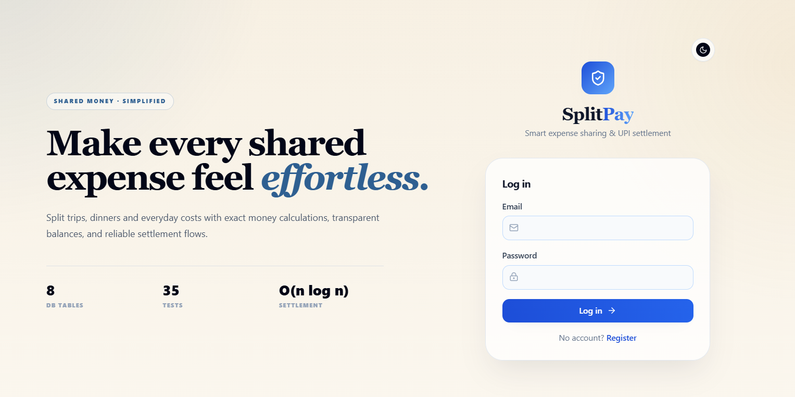

### Dashboard (home)
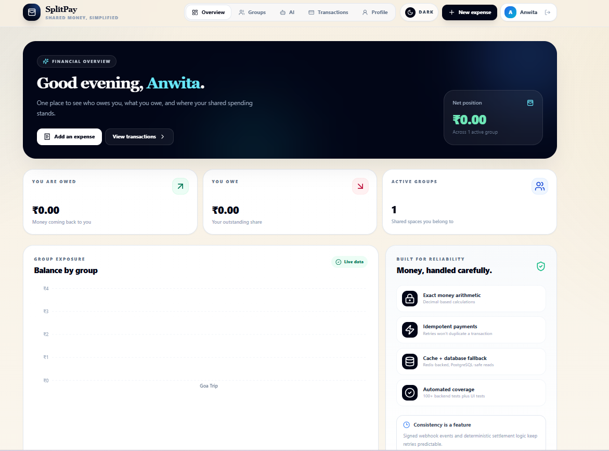

### Groups
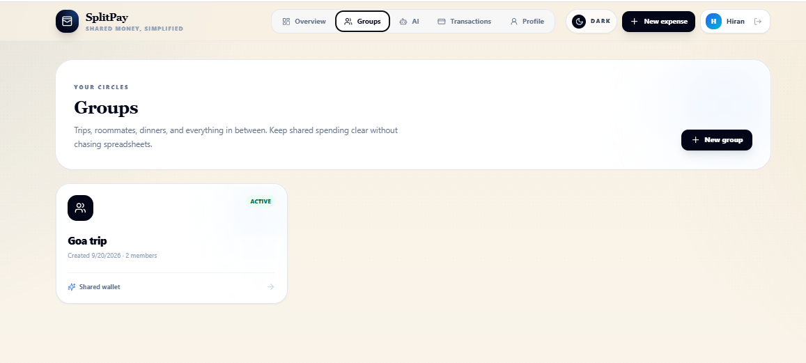

### Group details — members, balances, expenses
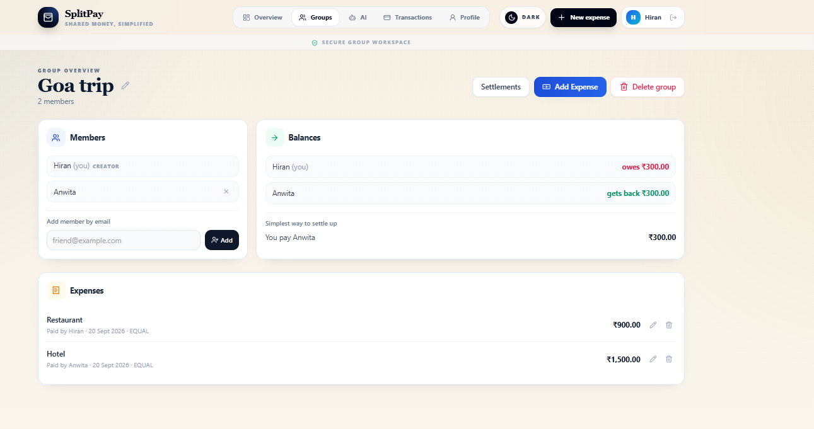

### Add / edit expense
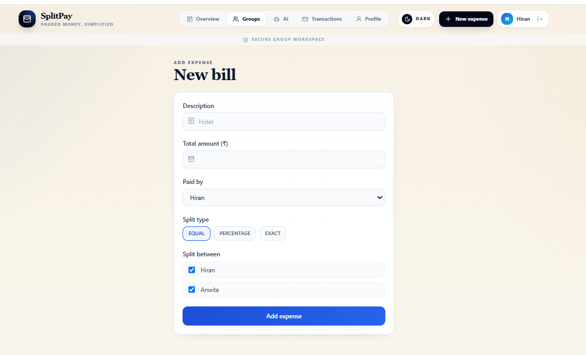


### AI assistant — draft, confirm, and balance questions
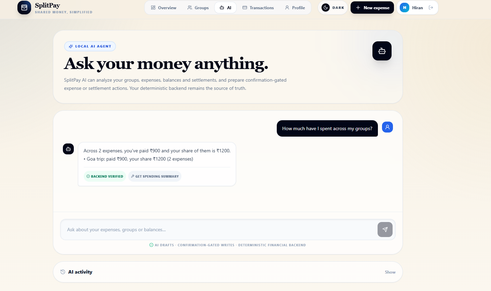

---

## Features

**Groups**
- Create, rename, and delete groups. Two groups may share a name; the app asks before creating a look-alike.
- Add members by email; members can leave, but only when they owe nothing and are owed nothing.
- Deleting a group removes everything inside it in one all-or-nothing step, and is blocked while a payment is in flight.

**Expenses**
- Split **equally**, by **percentage**, or by **exact amounts**. Create, edit, and delete.
- Money is exact (no floating point). ₹100 split three ways becomes ₹33.33 + ₹33.33 + ₹33.34, and the shares always add back to the total.

**Balances and settlement**
- One balance calculation used everywhere: expenses **minus completed settlements**.
- "Simplest way to settle up" shows the fewest payments that clear the group.
- Pay through the UPI-style flow, or mark a debt as **paid outside the app** (cash, direct transfer).

**AI assistant (runs locally with Ollama, no paid API)**
- Answers balance and spending questions from the database.
- Turns "I paid ₹2400 for dinner with Anwita in Goa Trip" into a **draft** you confirm or cancel.
- Can start a settlement for you. Nothing is saved until you press **Confirm**.

**Quality**
- Loading, empty, and error screens; confirmation dialogs for anything destructive; toast messages.
- Light and dark themes.
- 100+ backend tests, a frontend UI test suite, and database migrations.

---

## System architecture

### The big picture

```text
                         ┌───────────────────────────────┐
                         │        Browser (React)        │
                         │  Vite · Tailwind · Router     │
                         └───────────────┬───────────────┘
                                         │ HTTPS / JSON  (JWT in header)
                         ┌───────────────▼───────────────┐
                         │   nginx  (serves the built    │
                         │   React app, SPA routing)     │
                         └───────────────┬───────────────┘
                                         │ REST
        ┌────────────────────────────────▼─────────────────────────────────┐
        │                        FastAPI backend                           │
        │                                                                  │
        │   ROUTES      auth · groups · expenses · settlements ·           │
        │   (HTTP)      payments · webhooks · ai                           │
        │                 │  validate input, check who is calling          │
        │                 ▼                                                │
        │   SERVICES    group · expense · split · balance · settlement ·   │
        │   (rules)     payment · draft · agent                            │
        │                 │  all business rules live here                  │
        │                 ▼                                                │
        │   MODELS      SQLAlchemy tables                                  │
        └───────┬───────────────────┬───────────────────┬──────────────────┘
                │                   │                   │
        ┌───────▼───────┐   ┌───────▼───────┐   ┌───────▼────────────┐
        │  PostgreSQL   │   │     Redis     │   │  Ollama (local AI) │
        │ source of     │   │ display cache │   │  qwen2.5:3b        │
        │ truth (money) │   │ only          │   │  optional          │
        └───────────────┘   └───────────────┘   └────────────────────┘

        Payment sandbox ──► POST /webhooks/payment  (signed, de-duplicated)
```

**The one rule to remember:** PostgreSQL is the only place the truth lives. Redis is a speed-up for the group page and is never used to make a decision. The AI model never touches the database; it can only call backend functions that the backend controls.

### Backend layers

| Layer | Folder | Job |
|---|---|---|
| Routes | `backend/app/api/routes/` | Thin HTTP layer: parse the request, identify the user, call a service, return JSON. No business rules here. |
| Services | `backend/app/services/` | All the rules: who may do what, how money is split, what a balance is. |
| Models | `backend/app/models/` | Database tables (SQLAlchemy). |
| Schemas | `backend/app/schemas/` | Request and response shapes (Pydantic); rejects bad input early. |
| Core | `backend/app/core/` | Config, JWT/password security, the Redis cache, shared error type. |

Key services:

| Service | Responsibility |
|---|---|
| `group_service` | Membership, rename, delete-with-cascade, and the **only** place that turns a group *name* into a group *id* |
| `split_service` | Exact-to-the-paisa splitting (equal / percentage / exact) |
| `balance_math` | Pure functions: compute net balances, simplify debts (no database) |
| `balance_service` | The single database-backed way to read a group's balances |
| `settlement_service` | Validates every settlement (UPI or manual), records manual ones |
| `payment_service` | Payment creation, idempotency, webhook processing |
| `draft_service` | AI drafts and the confirm / cancel gate |
| `agent_service` | Understands chat messages and calls the services above |

### Key design decisions

| Decision | Why |
|---|---|
| **IDs, not names** | Everything is looked up by UUID. Names are only labels, so two groups called "Goa Trip" can never be mixed up. |
| **Exact money** | `Decimal` in Python and `NUMERIC(12,2)` in PostgreSQL. Inputs with more than two decimals are rejected. |
| **One balance calculation** | The REST API, dashboard, payments, and AI all read the same function, so they can never disagree. |
| **Modular monolith** | One deployable service, split by feature inside. Simple to run and reason about; easy to split later if needed. |
| **Confirmation gate for AI** | The AI *prepares* a draft; only a user click *executes* it. A wrong guess by the model cannot become a real transaction. |
| **Deterministic AI paths first** | Common requests are parsed by ordinary code, not the model, so they are reliable and work even when Ollama is off. |
| **Cache after commit** | Redis is cleared only once the database transaction has really committed. |
| **Migrations** | Alembic versions the schema, and runs automatically when the backend container starts. |

### Frontend

React single-page app. Pages call the API through one Axios client that attaches the login token and signs you out on a 401.

```text
frontend/src/
├── pages/        Dashboard · Groups · GroupDetails · AddExpense (also edit) ·
│                 Settlements · Transactions · TransactionDetails · AI · Login · Register
├── components/   ConfirmDialog · PageState (loading / error) · Navbar · ProtectedRoute
├── context/      AuthContext (who is logged in) · ToastContext (pop-up messages)
├── services/     api.js (Axios client)
└── utils/        format.js (money, dates) · errors.js (readable error messages)
```

---

## Data model

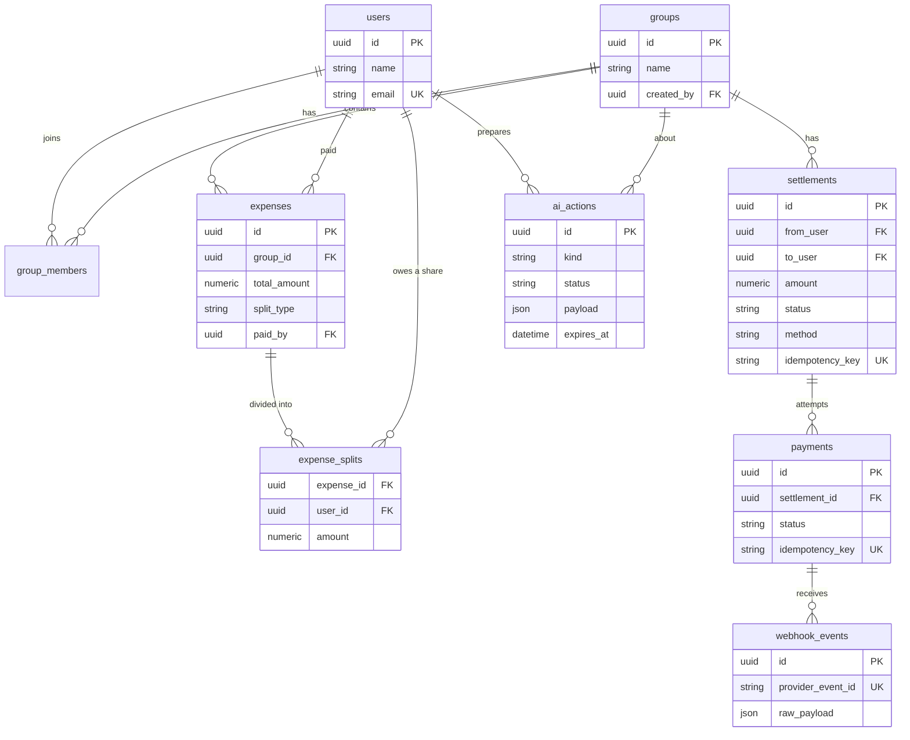

Rules the database itself enforces: money columns are `NUMERIC(12,2)`, and the idempotency keys and `provider_event_id` are **unique**, so a duplicate request or webhook cannot create a second row even if two arrive at the same instant.

The schema is built by Alembic migrations in `backend/alembic/versions/`:
`0001_baseline` (the original tables) and `0002_ledger_ai` (settlement method, expense edit time, AI drafts). Re-running migrations is always safe.

---

## How balances work

Sign convention used in the API: **positive = is owed money, negative = owes money.** All balances in a group add up to zero. The screens and the AI never show a minus sign; they say who owes whom.

```text
balance(person) =   what they paid
                  − their share of every expense
                  + settlements they paid
                  − settlements they received      (completed ones only)
```

**Worked example (Goa Trip, Anwi and Anwita):**

| Step | Anwi | Anwita | What the app says |
|---|---|---|---|
| Anwi pays ₹2400 for dinner, split equally | +₹1200 | −₹1200 | "Anwita owes you ₹1200" |
| Anwita pays Anwi ₹1200 (UPI, or marked paid outside the app) | ₹0 | ₹0 | "Everyone is settled up" |

**Simplifying debts:** the largest creditor is matched with the largest debtor, over and over, until everyone is at zero. Ties are broken by user id, so the same balances always give the same suggestions. This gives at most (people − 1) payments.

**Which settlements count:**

| Status | Counts toward balances? |
|---|---|
| `COMPLETED` (UPI success or manually recorded) | Yes |
| `PROCESSING` (payment in flight) | Reserved when validating a new settlement, so the same debt can't be paid twice |
| `PENDING` (a suggestion) / `CANCELLED` | No |

---

## Payment flow

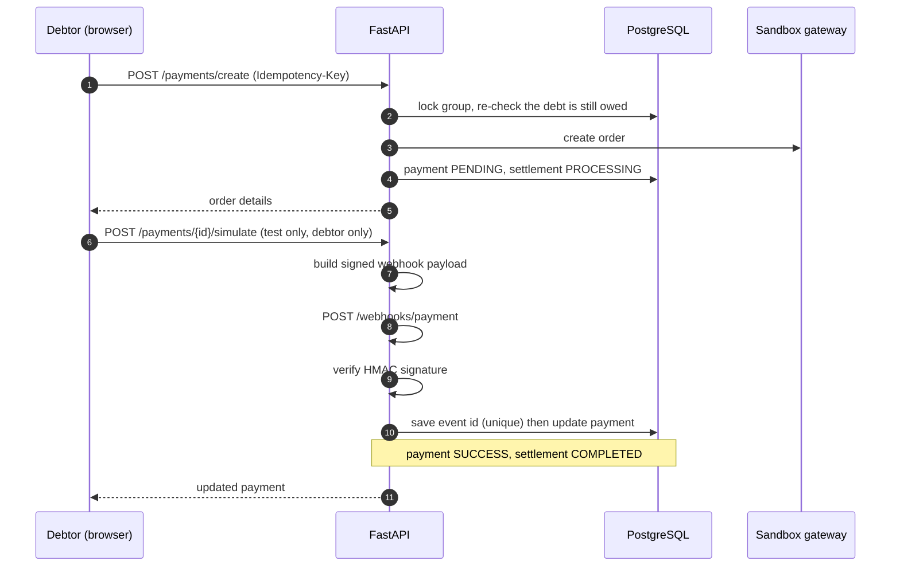

What makes it safe:

- **The browser never decides a payment succeeded.** Only a verified webhook can.
- **Same key, same payment.** Retrying `POST /payments/create` with the same `Idempotency-Key` returns the original payment. A key can't be reused for a different settlement, and a settlement with a payment in flight rejects a new key.
- **Repeated webhooks are harmless.** The event id is stored under a unique constraint; a replay is reported as `duplicate_ignored`.
- **Final is final.** A late `payment.failed` for a payment already `SUCCESS` is ignored and cannot re-open a completed settlement.
- **Failure is recoverable.** A failed payment puts the settlement back to `PENDING` so the user can retry.
- **Stale suggestions are refused.** If an expense changed after the suggestion was made, creating the payment re-checks the balances and refuses.

**Going live:** `PaymentProvider` is the swap point. A real gateway (for example Razorpay in test mode) means adding one class and changing one line in `get_payment_provider()`. That integration is deliberately not included, because shipping untested code against a live API would be a false claim.

---

## AI assistant

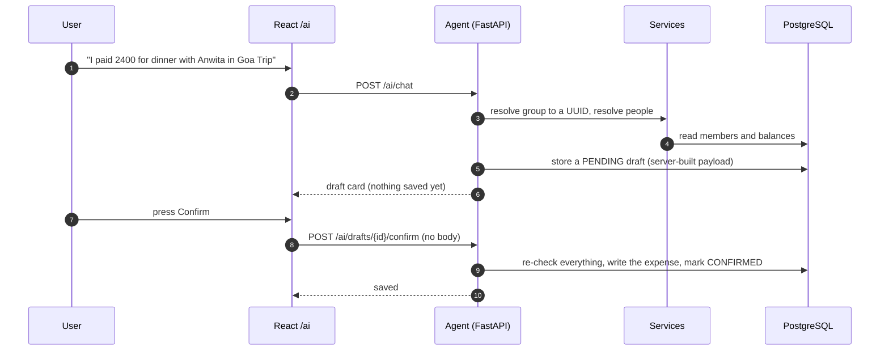

**How a message is handled**

1. **Deterministic first.** Balance questions, "I paid … with …", and "settle …" are understood by ordinary code. They work even if Ollama is off.
2. **Otherwise the model.** Anything else goes to the local model (Ollama, default `qwen2.5:3b`), which may call the read and *prepare* tools.
3. **Replies come from data.** Amounts and names in the answer are taken from the database, not written by the model.

**Guarantees (each has a test)**

| Guarantee | How |
|---|---|
| The AI cannot write | It has read tools and two *prepare* tools. There is no confirm, create, or delete tool, and unknown tool names are refused. |
| Only a click executes a draft | `POST /ai/drafts/{id}/confirm` takes just the draft id and runs the payload the *server* stored. |
| No double writes | Confirming twice returns the first result; the draft row is locked while confirming. |
| Drafts can't go stale silently | Confirm re-validates; if a member left or the debt was already settled, the draft is marked `FAILED` and nothing is written. |
| Typing "yes" doesn't save | The chat replies that only the Confirm button counts. |
| Same-name groups are never guessed | You get one button per candidate; your choice is sent back as an exact group id. |
| No invented people | "you", "me", and your own name are the same person; unknown names are an error. |
| Nobody else's data | A group id you don't belong to is simply "not found". Drafts are visible only to their owner. |

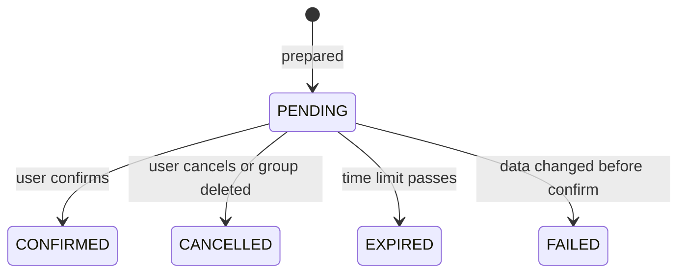

A settlement made through the AI is recorded as **paid outside SplitPay**. UPI payments stay on the Settlements page.

---

## Keeping data correct

| Risk | Protection |
|---|---|
| Two people change the same group at once | The group row is locked (`SELECT … FOR UPDATE`) during balance-changing operations |
| Same draft confirmed from two tabs | Row lock plus a status check; tested with 6 parallel confirms → exactly one expense |
| Overspending a debt | Every settlement is validated against current balances, including payments in flight; tested with 6 parallel settlements of a ₹500 debt → only one succeeds |
| Half-finished deletes | Group deletion runs in one transaction in dependency order and rolls back entirely on any error |
| Stale cache | Cleared after commit, never on rollback; decisions never read the cache |
| Redis is down | The app carries on with PostgreSQL and backs off retrying for a few seconds |
| Removing someone who still owes money | Blocked, with a clear message |

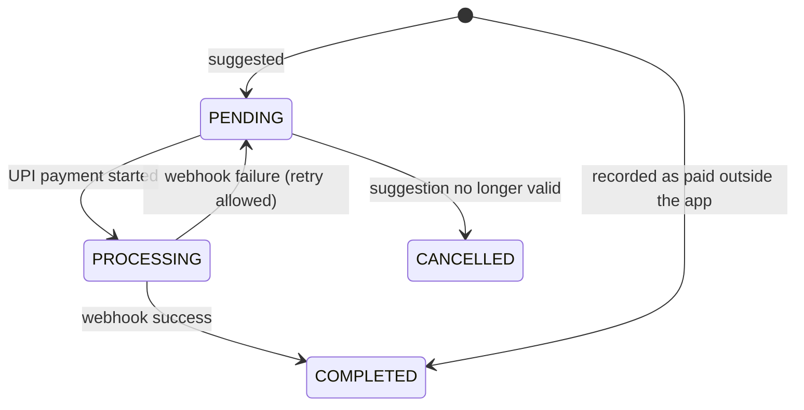

---

## Project structure

```text
splitpay/
├── backend/
│   ├── app/
│   │   ├── api/routes/      HTTP endpoints
│   │   ├── services/        business rules
│   │   ├── models/          database tables
│   │   ├── schemas/         request / response shapes
│   │   ├── core/            config, security, cache, errors
│   │   ├── db/              session and base types
│   │   ├── tests/           backend tests
│   │   └── main.py
│   ├── alembic/             database migrations
│   ├── Dockerfile
│   └── requirements.txt
├── frontend/
│   ├── src/                 pages, components, context, services, utils, __tests__
│   ├── Dockerfile · nginx.conf
│   └── package.json
├── scripts/                 init-extensions.sql, real-PostgreSQL check scripts
├── docs/                    design notes (AI agent, system design, changelog)
│   └── screenshots/         images used in this README
└── docker-compose.yml       postgres · redis · backend · frontend
```

---

## Getting started

### What you need

- **Docker Desktop** (running)
- Optional, for free-form AI questions: **[Ollama](https://ollama.com)**

### Run with Docker (recommended)

**1. Copy the settings files**

Mac / Linux:
```bash
cp .env.example .env
cp backend/.env.example backend/.env
cp frontend/.env.example frontend/.env
```
Windows Command Prompt:
```bat
copy .env.example .env
copy backend\.env.example backend\.env
copy frontend\.env.example frontend\.env
```

**2. Set two secrets** in `backend/.env` — `SECRET_KEY` and `PAYMENT_WEBHOOK_SECRET`. Use two different long random values:
```bash
python -c "import secrets; print(secrets.token_urlsafe(48))"
```

**3. Start everything**
```bash
docker compose up --build
```
The backend applies the database migrations itself on start.

**4. Open**

| What | Where |
|---|---|
| App | http://localhost:5173 |
| API docs (Swagger) | http://localhost:8001/docs |

Ports used: 5173 (app), 8001 (API), 5433 (PostgreSQL), 6380 (Redis). If one is taken, change the left-hand number in `docker-compose.yml`.

**Stop / reset**
```bash
docker compose down        # stop
docker compose down -v     # stop and delete the database
```

### Turn on the AI (optional)

```bash
ollama pull qwen2.5:3b     # once; then keep Ollama running
```
The backend reaches Ollama at `http://host.docker.internal:11434` (works on Windows and Mac; on Linux set `OLLAMA_BASE_URL` in `backend/.env`). Without Ollama, balance questions, expense drafts, and settlements phrased directly still work; other questions get a friendly "start Ollama" message.

### Run without Docker

```bash
# Backend
cd backend
python -m venv venv
venv\Scripts\activate            # Windows   (Mac/Linux: source venv/bin/activate)
pip install -r requirements.txt
copy .env.example .env           # Mac/Linux: cp .env.example .env   — then set the two secrets

# PostgreSQL and Redis (any way you like; Docker shown)
docker run --name splitpay-postgres -e POSTGRES_USER=splitpay -e POSTGRES_PASSWORD=splitpay -e POSTGRES_DB=splitpay -p 5432:5432 -d postgres:16
docker run --name splitpay-redis -p 6379:6379 -d redis:7-alpine

alembic upgrade head             # create / upgrade the tables
uvicorn app.main:app --reload --port 8000
```
```bash
# Frontend (new terminal)
cd frontend
copy .env.example .env           # Mac/Linux: cp
npm install
npm run dev
```
For this mode, set `VITE_API_BASE_URL=http://localhost:8000` in `frontend/.env`.

### Environment variables

| Variable | Purpose |
|---|---|
| `DATABASE_URL` | PostgreSQL connection |
| `SECRET_KEY`, `ALGORITHM`, `ACCESS_TOKEN_EXPIRE_MINUTES` | Login tokens (JWT) |
| `CORS_ORIGINS` | Allowed frontend addresses (JSON list) |
| `REDIS_URL`, `CACHE_TTL_SECONDS` | Cache |
| `PAYMENT_SANDBOX_MODE`, `PAYMENT_WEBHOOK_SECRET` | Sandbox payments and webhook signing |
| `OLLAMA_BASE_URL`, `OLLAMA_MODEL`, `OLLAMA_TIMEOUT_SECONDS` | Local AI |
| `AI_DETERMINISTIC_INTENTS` | `true`: common requests handled by code (recommended) |
| `AI_DRAFT_TTL_MINUTES` | How long a draft stays confirmable |
| `VITE_API_BASE_URL` (frontend) | Where the frontend finds the API |

Never commit real `.env` files; only the `.env.example` files belong in the repository.

---

## Try it in 2 minutes

1. Register two accounts (use a private window for the second). Name the second one **Anwita** so the example below matches.
2. As the first user, create a group **Goa Trip** and add the second user by email.
3. Open **AI** and type:
   *I paid ₹2400 for dinner with Anwita in Goa Trip. Split it equally.*
   A draft card appears with ₹1200 each. Nothing is saved yet.
4. Press **Confirm expense**, then ask: *Who owes me money in Goa Trip?*
   → "Anwita owes you ₹1200 in Goa Trip."
5. Type: *I want to settle the ₹1200 Anwita owes me.* Confirm the settlement draft.
6. Ask again → "No one currently owes you money in Goa Trip."
7. Also try: create a second group with the same name and ask the AI about it — it asks which one you mean. Delete an expense on the group page and watch the balances update.

---

## API overview

Interactive docs are at `/docs`. Errors look like `{"detail": "...", "code": "MACHINE_CODE"}`.

| Area | Endpoints |
|---|---|
| Auth | `POST /auth/register` · `POST /auth/login` · `GET /auth/me` |
| Groups | `POST /groups` · `GET /groups` · `GET /groups/{id}` · `PATCH /groups/{id}` · `DELETE /groups/{id}` |
| Members | `POST /groups/{id}/members` · `DELETE /groups/{id}/members/{user_id}` |
| Expenses | `POST /expenses` · `GET /groups/{id}/expenses` · `GET`/`PUT`/`DELETE /expenses/{id}` |
| Settlements | `POST /groups/{id}/settlements/generate` · `GET /groups/{id}/settlements` · `POST /groups/{id}/settlements/record` · `GET /settlements/{id}` |
| Payments | `POST /payments/create` · `GET /payments` · `GET /payments/{id}` · `POST /payments/{id}/simulate` (sandbox) · `GET /payments/transactions/list` · `GET /payments/transactions/{id}` |
| Webhook | `POST /webhooks/payment` (signature-verified) |
| AI | `POST /ai/chat` · `POST /ai/drafts/{id}/confirm` · `POST /ai/drafts/{id}/cancel` · `GET /ai/actions` |

---

## Testing

```bash
# Backend — about 100 tests, run in memory
cd backend && pip install -r requirements.txt && pytest -q

# Frontend — UI tests
cd frontend && npm install && npm test -- --run
```

The backend tests cover: split maths, balances and settlements, group lifecycle and deletion, expense edit and delete, payment idempotency, webhook signatures / duplicates / late events, authorization (other users' groups, expenses, settlements, payments, AI drafts), and the full AI flow including the confirm gate.

Two extra checks need a real PostgreSQL (row locks, unique indexes). Run them after `alembic upgrade head` on an empty database — see the header of each script for the exact command:

```bash
python scripts/e2e_acceptance_pg.py    # draft → confirm → balance → settle → settled
python scripts/concurrency_pg.py       # parallel confirms and settlements stay correct
```

---

## Security

- Passwords are hashed (bcrypt); login uses signed JWTs that expire (24 hours by default, `ACCESS_TOKEN_EXPIRE_MINUTES`).
- Every endpoint that touches group data checks membership first. Someone outside a group gets "not found", which doesn't even reveal that the group exists.
- The webhook verifies an HMAC-SHA256 signature over the raw body before trusting it.
- The sandbox "simulate" endpoint works only for the debtor and can be switched off with `PAYMENT_SANDBOX_MODE=false`.
- The AI has no credentials, runs no SQL, and has no way to confirm its own drafts.
- Amounts are validated (positive, two decimals, upper bound) before they reach the database.

---

## Limitations and next steps

Honest list of what this project does **not** do:

- **No real payment gateway** — sandbox only (see [Payment flow](#payment-flow)).
- **Tokens can't be revoked before they expire.** A production system would add short-lived tokens with refresh tokens.
- **Single backend instance.** Locks and caching assume one API process talking to one database; scaling out would need a shared queue for webhooks and more care with the cache.
- **The AI is a small local model.** Common requests are handled by plain code for that reason; free-form understanding is limited to what the model can do.
- **Migrations only go forward.** Downgrades are deliberately refused rather than risk deleting data.
- **Equal splits only in the AI.** Percentage and exact splits use the Add Expense form.

Ideas for next steps: real gateway integration, refresh tokens, webhook processing on a queue, recurring expenses, receipts, and multiple currencies.

---

## Plain-English glossary

| Term | Meaning |
|---|---|
| **Idempotent** | Doing it twice has the same effect as doing it once. Tapping "Pay" twice must not charge twice. |
| **Webhook** | A message the payment provider sends to our server to say "this payment finished". |
| **HMAC signature** | A secret-based stamp proving the message really came from the provider and wasn't altered. |
| **Migration** | A versioned change to the database structure, applied by a tool (Alembic) instead of by hand. |
| **Draft** | A prepared-but-unsaved change. Nothing happens until the user confirms it. |
| **UUID** | A long random id (like `3f2b…`) used instead of names to identify things. |
| **Decimal / NUMERIC** | Exact number types for money, unlike floating point which can drift by a paisa. |
| **Cache** | A fast temporary copy of data. Here it is only for display, never for decisions. |
| **Row lock** | A database feature that makes two simultaneous changes to the same record wait their turn. |
